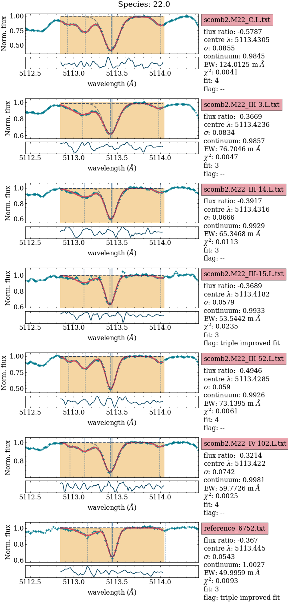

# REvIEW
***R***outine for
***Ev***aluating and 
***I***nspecting
***E***quivalent
***W***idths

## Overview
REvIEW allows you to fit the equivelent width (EW) of absorbtion features for high resolution spectra.

There are a range of incredible codes avaliable to do this ([DAOSpec](https://www.cadc-ccda.hia-iha.nrc-cnrc.gc.ca/en/community/STETSON/daospec/), [SMHR](https://github.com/andycasey/smhr) to name a few), however the goal of REvIEW is to provide a **simple, streamline aproach** to EW fitting that runs on your computer without any fiddling around. 


>Spend your time thinking about abundances, not code installation.


REvIEW was designed to be used for high precision differential abundance measurements using the code [q2](https://github.com/astroChasqui/q2) (see the jupyter notebook [REvIEW_TO_q2.ipynb](REvIEW_TO_q2.ipynb) for exporting the EW to a q2 format), where each fit to both the continuum and the absorbtion feature needed to be manually inspected to give the most precise results possible. However it can be passed directly to MOOG if you don't need such high precision results. 

### Credit

This code is based on the IDL script `postage40mpfit.pro` by Dr David Yong.

## Using REvIEW

A python instalation (>3.7) is neccecary to run this code (get [anaconda](https://www.anaconda.com/)). 

Recent updates to the code which use a neural network (NN) back end require the user to install pytorch

```bash
conda install pytorch torchvision torchaudio -c pytorch
``` 

Spectra to be analysed needs to be in a continuum normalised .txt format with one column the wavelength, and the other the normalised flux. Future releases will allow for .fits files as well as .txt (I'm working on it).

## How it works

REvIEW was designed to be used with a small sample of stars.

An example output used in McKenzie et al. 2022 is:



Both the NN and `curve_fit` will be used to fit the absorbtion feature, and the model with the lowest chi^2 value is used. More details on how this works is given in the file [REVIEW_info](REVIEW_info.md).

For each line given in the line list (in the past, I have found [linemake](https://github.com/vmplacco/linemake) very helpful for generating a line list), a plot with X number of stars will be generated (see above), and this information appended to a .csv document. Then each plot can be visually inspected and poor fits can be manually removed by editing the .csv file. Future versions of this code will hopefully have an interactive version where you can click on the plot to remove poor fits (it's on the TODO list).


## Found REvIEW helpful?

If you used this code during your abundance analysis, I would love it if you could cite McKenzie et al. 2022 (The complex stellar system M 22: confrming abundance variations with high precision diferential measurements).

## Questions?
If you have any questions about the installation process or the code, or any ideas for how to make REvIEW better? Please email me using madeleine.mckenzie \at\ gmail.com to discuss!
